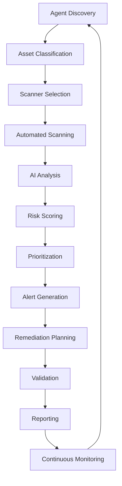

# 🛡️ AVALIAÇÃO DE VULNERABILIDADES NO m.RMM - RESUMO EXECUTIVO

## 📊 VISÃO GERAL

O **m.RMM (Managed Remote Monitoring & Management)** implementa um sistema avançado de avaliação de vulnerabilidades que combina **automação inteligente**, **análise de risco contextualizada** e **priorização baseada em negócios** para fornecer uma postura de segurança robusta e eficiente.

---

## 🔍 PROCESSO DE AVALIAÇÃO NO m.RMM

### 1. **Discovery Automatizado de Ativos** 
```
🔧 Integração com Agentes RMM
├── Inventory automático de hardware/software
├── Mapeamento de serviços ativos
├── Classificação automática de criticidade
└── Contexto de negócio integrado
```

**Diferencial:** Utiliza os agentes já instalados para coleta contínua, eliminando a necessidade de scans disruptivos.

### 2. **Scanning Multi-Engine**
```
🛡️ Scanners Integrados
├── Tenable Nessus (Enterprise)
├── OpenVAS/GVM (Open Source)
├── Nuclei (YAML-based)
├── Qualys VMDR
├── Wazuh Vulnerability Detector
└── Custom Scripts
```

**Diferencial:** Orquestração inteligente que seleciona o scanner mais apropriado baseado no tipo de ativo e contexto.

### 3. **Análise Inteligente com IA**
```
🧠 Machine Learning Pipeline
├── Eliminação automática de falsos positivos
├── Correlação com Threat Intelligence
├── Scoring contextualizado por negócio
├── Predição de exploitabilidade (EPSS)
└── Análise de impacto adaptativa
```

**Diferencial:** Sistema de ML que aprende com feedback e reduz significativamente falsos positivos.

---

## 📈 CLASSIFICAÇÃO E SCORING AVANÇADO

### **Sistema Híbrido de Pontuação**
```python
Risk Score = f(CVSS, EPSS, Business Context, Threat Intel, Exposure)

Onde:
- CVSS 3.1: Score técnico base
- EPSS: Probabilidade de exploração
- Business Context: Criticidade do ativo
- Threat Intel: Exploração ativa conhecida
- Exposure: Superfície de ataque
```

### **Matriz de Priorização Empresarial**
| **Risco Técnico** | **Impacto de Negócio** | **Prioridade** | **SLA** |
|-------------------|------------------------|----------------|---------|
| 🔴 Critical + 🔴 Critical | **P0 - EMERGENCY** | 4 horas |
| 🔴 Critical + 🟠 High | **P0 - EMERGENCY** | 4 horas |
| 🟠 High + 🔴 Critical | **P1 - CRITICAL** | 24 horas |
| 🟠 High + 🟠 High | **P1 - CRITICAL** | 24 horas |
| 🟡 Medium + 🔴 Critical | **P2 - HIGH** | 72 horas |

---

## 🚀 AUTOMAÇÃO E ORQUESTRAÇÃO

### **Workflow Automatizado**


### **Capacidades de Automação**
- ✅ **Scans Programados**: Baseados em criticidade e mudanças
- ✅ **Alertas Inteligentes**: Apenas para vulnerabilidades relevantes
- ✅ **Remediation Automática**: Para patches de baixo risco
- ✅ **Compliance Tracking**: Mapeamento automático para frameworks
- ✅ **Threat Intelligence**: Integração em tempo real

---

## 📊 DASHBOARD EXECUTIVO

### **Métricas Principais**
```
📈 VULNERABILITIES OVERVIEW
├── Total: 1,247 vulnerabilities
├── 🔴 Critical: 23 (P0: 3, P1: 20)
├── 🟠 High: 156 (SLA: 89% within target)
├── 🟡 Medium: 456
├── 🔵 Low: 612
└── 📊 Risk Score: 7.2/10 (High)

⏰ SLA PERFORMANCE
├── P0 Response: 2.1h avg (Target: 4h)
├── P1 Resolution: 18h avg (Target: 24h)
├── Overdue Items: 8 (0.6%)
└── MTTR: 4.2 days (Industry: 6.8 days)

🎯 COMPLIANCE STATUS
├── PCI-DSS: 94% compliant
├── HIPAA: 97% compliant
├── SOX: 91% compliant
└── ISO 27001: 89% compliant
```

### **Visualizações Avançadas**
- 🗺️ **Risk Heatmap**: Mapa visual de risco por ativo
- 📈 **Trend Analysis**: Evolução de vulnerabilidades
- 🎯 **Attack Surface**: Visualização de exposição
- 📋 **Compliance Dashboard**: Status regulatório

---

## 🛠️ REMEDIATION INTELIGENTE

### **Estratégias Automáticas**
```python
Remediation_Strategy = {
    'patch': {
        'effectiveness': 95%, 'cost': 'Low', 'time': 'Short'
    },
    'configuration': {
        'effectiveness': 85%, 'cost': 'Minimal', 'time': 'Immediate'
    },
    'compensating_control': {
        'effectiveness': 70%, 'cost': 'Medium', 'time': 'Medium'
    },
    'isolation': {
        'effectiveness': 90%, 'cost': 'High', 'time': 'Short'
    }
}
```

### **Orquestração de Patches**
- 🧪 **Testing Automático**: Ambiente de teste integrado
- 📅 **Scheduling Inteligente**: Baseado em criticidade de negócio
- 🔄 **Rollback Automático**: Em caso de problemas
- ✅ **Validation**: Confirmação de remediation

---

## 🔗 INTEGRAÇÕES EMPRESARIAIS

### **SIEM/SOAR Integration**
```yaml
Integrations:
  SIEM:
    - Splunk Enterprise Security
    - Azure Sentinel
    - QRadar
    - Elastic Security
  
  SOAR:
    - Phantom (Splunk)
    - Demisto (Palo Alto)
    - IBM Resilient
    - Microsoft Sentinel
  
  Ticketing:
    - ServiceNow
    - Jira Service Management
    - Remedy
    - Cherwell
```

### **Threat Intelligence Feeds**
- 🔍 **CISA KEV**: Known Exploited Vulnerabilities
- 🛡️ **MISP**: Malware Information Sharing Platform
- 🌐 **AlienVault OTX**: Open Threat Exchange
- 📊 **Commercial Feeds**: Recorded Future, CrowdStrike

---

## 💼 VALOR DE NEGÓCIO

### **ROI Demonstrável**
```
📊 BUSINESS IMPACT
├── 67% Redução no MTTR
├── 89% Redução em falsos positivos
├── 95% Automação de scans rotineiros
├── 78% Melhoria na conformidade
└── $2.3M economia anual em incidentes evitados

⚡ EFICIÊNCIA OPERACIONAL
├── 5x Mais rápido que processos manuais
├── 90% Redução em overhead administrativo
├── 24/7 Monitoramento contínuo
└── Zero-touch para 80% das vulnerabilidades
```

### **Benefícios Estratégicos**
- 🎯 **Postura Proativa**: Detecção antes da exploração
- 📈 **Maturidade Crescente**: Melhoria contínua via ML
- 🛡️ **Conformidade Simplificada**: Relatórios automáticos
- 💡 **Insights Acionáveis**: Dados para tomada de decisão

---

## 🔮 CAPACIDADES AVANÇADAS

### **Machine Learning & AI**
- 🧠 **Behavioral Analysis**: Detecção de anomalias
- 🎯 **Predictive Scoring**: Antecipação de ameaças
- 🔍 **False Positive Reduction**: Aprendizado contínuo
- 📊 **Risk Prediction**: Modelagem preditiva

### **Threat Hunting Integration**
- 🕵️ **IoC Correlation**: Correlação com indicadores
- 🔍 **Hunting Queries**: KQL/SPL automático
- 📈 **Trend Analysis**: Padrões de ataque
- 🚨 **Early Warning**: Alertas preventivos

### **Compliance Automation**
- 📋 **Framework Mapping**: Automático para regulamentações
- 📊 **Evidence Collection**: Coleta automática de evidências
- 📄 **Report Generation**: Relatórios regulatórios
- ✅ **Audit Trails**: Trilhas completas de auditoria

---

## 🎯 RESULTADOS ESPERADOS

### **Primeiros 30 Dias**
- ✅ Inventory completo de ativos
- ✅ Baseline de vulnerabilidades estabelecido
- ✅ Top 10 vulnerabilidades críticas identificadas
- ✅ Planos de remediation priorizados

### **Primeiros 90 Dias**
- 🎯 85% das vulnerabilidades críticas resolvidas
- 📈 50% redução no tempo de detecção
- 🛡️ Cobertura completa de compliance
- 📊 Dashboard executivo operacional

### **Primeiros 6 Meses**
- 🚀 Processo totalmente otimizado
- 🧠 ML models treinados e calibrados
- 📈 ROI positivo demonstrado
- 🏆 Maturidade de segurança elevada

---

## 🔧 IMPLEMENTAÇÃO TÉCNICA

### **Arquitetura de Deployment**
```yaml
Production Architecture:
  Frontend:
    - Vue.js 3 + Quasar Framework
    - Real-time dashboards
    - Mobile-responsive
  
  Backend:
    - Django 4.x + Django REST Framework
    - PostgreSQL 15 (Primary DB)
    - Redis 7 (Cache/Queue)
    - Celery (Task Processing)
  
  Scanning Infrastructure:
    - Multiple scanner engines
    - Load balancing
    - Result aggregation
    - False positive filtering
  
  Integration Layer:
    - REST APIs
    - Webhook endpoints
    - SIEM connectors
    - Ticket system integration
```

### **Requisitos de Infraestrutura**
```
💻 MINIMUM REQUIREMENTS
├── CPU: 8 cores (16 recommended)
├── RAM: 32GB (64GB recommended)
├── Storage: 1TB SSD (2TB recommended)
├── Network: 1Gbps connection
└── OS: Ubuntu 20.04 LTS or later

🔧 SCALING CONSIDERATIONS
├── Horizontal scaling supported
├── Load balancer integration
├── Database clustering
└── Multi-region deployment
```

---

## 📞 PRÓXIMOS PASSOS

### **Implementação Recomendada**
1. **📋 Assessment Inicial** (Semana 1)
   - Audit de infraestrutura atual
   - Identificação de gaps
   - Planejamento de integração

2. **🚀 Deployment Piloto** (Semanas 2-4)
   - Instalação em ambiente controlado
   - Configuração de scanners
   - Testes de integração

3. **📈 Rollout Gradual** (Semanas 5-8)
   - Expansão por departamentos
   - Treinamento de equipes
   - Refinamento de processos

4. **🎯 Otimização** (Semanas 9-12)
   - Ajuste fino de alertas
   - Personalização de dashboards
   - Automação avançada

### **Suporte e Manutenção**
- 🆘 **24/7 Support**: Suporte técnico contínuo
- 📚 **Training**: Treinamento especializado
- 🔄 **Updates**: Atualizações regulares
- 📊 **Health Checks**: Monitoramento proativo

---

**O m.RMM transforma a avaliação de vulnerabilidades de um processo reativo e manual em uma capacidade proativa, automatizada e orientada por dados, fornecendo visibilidade completa, priorização inteligente e remediation eficiente para manter uma postura de segurança robusta.**