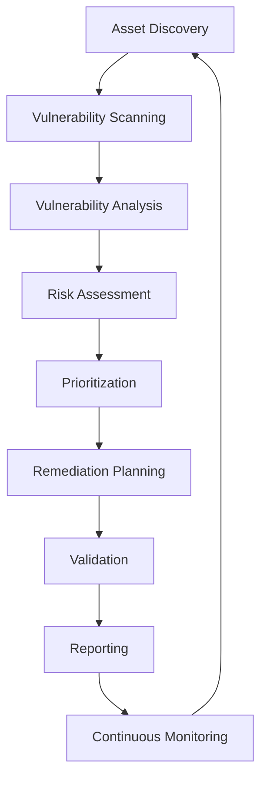

# 🛡️ AVALIAÇÃO DE VULNERABILIDADES - ANÁLISE PROFUNDA

## 📋 Índice
1. [Conceitos Fundamentais](#conceitos-fundamentais)
2. [Processo de Avaliação](#processo-de-avaliação)
3. [Metodologias e Frameworks](#metodologias-e-frameworks)
4. [Ferramentas e Scanners](#ferramentas-e-scanners)
5. [Classificação e Scoring](#classificação-e-scoring)
6. [Análise de Risco](#análise-de-risco)
7. [Priorização e Remediation](#priorização-e-remediation)
8. [Implementação no m.RMM](#implementação-no-mrmm)

---

## 1. CONCEITOS FUNDAMENTAIS

### 1.1 O que é uma Vulnerabilidade?

Uma **vulnerabilidade** é uma fraqueza ou falha em um sistema, aplicação, rede ou processo que pode ser explorada por ameaças para comprometer a segurança, integridade, disponibilidade ou confidencialidade dos dados.

```
Vulnerabilidade = Ativo + Ameaça + Impacto Potencial
```

### 1.2 Tipos de Vulnerabilidades

#### **Por Categoria Técnica:**
- **Software Vulnerabilities**: Bugs, buffer overflows, injection flaws
- **Configuration Vulnerabilities**: Misconfigurations, default passwords
- **Network Vulnerabilities**: Open ports, weak protocols
- **Hardware Vulnerabilities**: Firmware bugs, physical access
- **Human Vulnerabilities**: Social engineering, insider threats

#### **Por Origem:**
- **Known Vulnerabilities**: CVE catalogadas
- **Zero-day Vulnerabilities**: Ainda não descobertas publicamente
- **Logic Flaws**: Falhas no design/lógica da aplicação
- **Implementation Bugs**: Erros de codificação

#### **Por Impacto:**
- **Remote Code Execution (RCE)**
- **Privilege Escalation**
- **Information Disclosure**
- **Denial of Service (DoS)**
- **Data Manipulation**

---

## 2. PROCESSO DE AVALIAÇÃO

### 2.1 Fases do Vulnerability Assessment



### 2.2 Fase 1: Asset Discovery (Descoberta de Ativos)

**Objetivo**: Identificar todos os ativos na infraestrutura.

#### **Técnicas de Discovery:**

```bash
# Network Discovery
nmap -sn 192.168.1.0/24                    # Ping sweep
nmap -sS -O 192.168.1.0/24                 # SYN scan with OS detection
masscan -p1-65535 192.168.1.0/24 --rate=1000

# Service Discovery
nmap -sV -sC 192.168.1.100                 # Version and script scan
nmap --script=discovery 192.168.1.100      # Discovery scripts

# DNS Enumeration
fierce -dns example.com
dnsrecon -d example.com -t axfr
amass enum -d example.com
```

#### **Asset Inventory Components:**
- **Hardware**: Servers, workstations, mobile devices, IoT
- **Software**: Operating systems, applications, databases
- **Network**: Routers, switches, firewalls, wireless APs
- **Cloud**: SaaS, PaaS, IaaS resources
- **Data**: Databases, file shares, cloud storage

### 2.3 Fase 2: Vulnerability Scanning

**Objetivo**: Identificar vulnerabilidades conhecidas nos ativos descobertos.

#### **Tipos de Scanning:**

##### **Network-based Scanning:**
```python
# Exemplo com Nessus API
import requests

def start_nessus_scan(targets, policy_id):
    scan_data = {
        "uuid": policy_id,
        "settings": {
            "name": f"Vulnerability Scan - {targets}",
            "text_targets": targets,
            "enabled": True,
            "scanner_id": "1",
            "policy_id": policy_id
        }
    }
    
    response = requests.post(
        f"{NESSUS_URL}/scans",
        headers={"X-ApiKeys": f"accessKey={ACCESS_KEY}; secretKey={SECRET_KEY}"},
        json=scan_data
    )
    
    return response.json()["scan"]["id"]
```

##### **Agent-based Scanning:**
- **Vantagens**: Visibilidade interna, acesso a logs locais
- **Desvantagens**: Requer instalação, pode impactar performance

##### **Authenticated vs Unauthenticated:**
- **Authenticated**: Maior profundidade, menos falsos positivos
- **Unauthenticated**: Perspectiva de atacante externo

#### **Scanning Profiles:**

```yaml
# Basic Network Scan
basic_scan:
  ports: "1-1000"
  intensity: "light"
  plugins:
    - port_scan
    - service_detection
    - basic_web_tests
  duration: "30min"

# Full Compliance Scan
compliance_scan:
  ports: "1-65535"
  intensity: "aggressive"
  plugins:
    - all_checks
    - compliance_checks
    - web_application_tests
  authentication: required
  duration: "4-6hours"

# Web Application Scan
webapp_scan:
  scope: "web_only"
  tests:
    - sql_injection
    - xss
    - csrf
    - authentication_bypass
  crawling: "extensive"
  duration: "2-3hours"
```

### 2.4 Fase 3: Vulnerability Analysis

**Objetivo**: Analisar e validar as vulnerabilidades encontradas.

#### **Processo de Análise:**

```python
class VulnerabilityAnalyzer:
    def analyze_vulnerability(self, vulnerability):
        analysis = {
            "is_valid": self.validate_vulnerability(vulnerability),
            "exploitability": self.assess_exploitability(vulnerability),
            "business_impact": self.assess_business_impact(vulnerability),
            "technical_impact": self.assess_technical_impact(vulnerability),
            "attack_vector": self.determine_attack_vector(vulnerability),
            "prerequisites": self.identify_prerequisites(vulnerability)
        }
        return analysis
    
    def validate_vulnerability(self, vuln):
        """Remove false positives"""
        # Version checking
        if vuln.affected_version and vuln.installed_version:
            return self.compare_versions(vuln.affected_version, vuln.installed_version)
        
        # Manual verification
        if vuln.requires_manual_check:
            return self.manual_verification(vuln)
        
        # Configuration validation
        return self.validate_configuration(vuln)
    
    def assess_exploitability(self, vuln):
        factors = {
            "attack_vector": vuln.attack_vector,  # Network, Adjacent, Local, Physical
            "attack_complexity": vuln.complexity, # Low, High
            "privileges_required": vuln.privileges, # None, Low, High
            "user_interaction": vuln.user_interaction, # None, Required
            "exploit_availability": self.check_exploit_availability(vuln.cve_id)
        }
        
        return self.calculate_exploitability_score(factors)
```

#### **Validação Manual:**
- **Port Verification**: Confirmar serviços em execução
- **Version Confirmation**: Validar versões exatas
- **Configuration Review**: Verificar configurações específicas
- **Proof of Concept**: Testes controlados quando necessário

### 2.5 Fase 4: Risk Assessment (Avaliação de Risco)

**Objetivo**: Quantificar o risco real para o negócio.

#### **Fórmula de Risco:**
```
Risco = Probabilidade × Impacto × Exposição
```

#### **Matriz de Risco:**

| Probabilidade | Impacto Baixo | Impacto Médio | Impacto Alto | Impacto Crítico |
|---------------|---------------|---------------|--------------|------------------|
| **Muito Alta** | Médio | Alto | Crítico | Crítico |
| **Alta** | Baixo | Médio | Alto | Crítico |
| **Média** | Baixo | Baixo | Médio | Alto |
| **Baixa** | Muito Baixo | Baixo | Baixo | Médio |

#### **Fatores de Probabilidade:**
- **Exploitability Score**: Facilidade de exploração
- **Threat Intelligence**: Ataques ativos conhecidos
- **Exposure**: Acessibilidade do ativo
- **Security Controls**: Medidas de proteção existentes

#### **Fatores de Impacto:**
- **Confidentialidade**: Vazamento de dados sensíveis
- **Integridade**: Modificação não autorizada
- **Disponibilidade**: Interrupção de serviços
- **Compliance**: Violações regulatórias
- **Reputação**: Danos à imagem

---

## 3. METODOLOGIAS E FRAMEWORKS

### 3.1 OWASP Testing Guide

#### **Web Application Testing:**
```
1. Information Gathering
   - Conduct Search Engine Discovery
   - Fingerprint Web Server
   - Review Webserver Metafiles
   - Enumerate Applications on Webserver

2. Configuration and Deployment Management Testing
   - Test Network/Infrastructure Configuration
   - Test Application Platform Configuration
   - Test File Extensions Handling
   - Review Old Backup and Unreferenced Files

3. Identity Management Testing
   - Test Role Definitions
   - Test User Registration Process
   - Test Account Provisioning Process

4. Authentication Testing
   - Test for Credentials Transported over Encrypted Channel
   - Test for Default Credentials
   - Test for Weak Lock Out Mechanism
   - Test for Bypassing Authentication Schema

5. Authorization Testing
   - Test Directory Traversal
   - Test for Bypassing Authorization Schema
   - Test for Privilege Escalation
   - Test for Insecure Direct Object References
```

### 3.2 NIST Cybersecurity Framework

#### **Core Functions aplicadas a Vulnerability Management:**

```yaml
IDENTIFY:
  asset_management:
    - inventory_physical_devices
    - inventory_software_platforms
    - inventory_organizational_communication
  
  business_environment:
    - organizational_mission
    - organizational_objectives
    - business_criticality
  
  governance:
    - information_security_policy
    - information_security_roles

PROTECT:
  access_control:
    - identity_management
    - access_permissions
    - network_integrity
  
  awareness_training:
    - security_awareness
    - privileged_user_training
    - third_party_training
  
  data_security:
    - data_at_rest_protection
    - data_in_transit_protection
    - data_development_protection

DETECT:
  anomalies_events:
    - baseline_network_operations
    - detected_events_analysis
    - event_impact_understanding
  
  security_monitoring:
    - network_monitoring
    - physical_environment_monitoring
    - personnel_activity_monitoring

RESPOND:
  response_planning:
    - response_plan_execution
    - response_plan_updates
    - communication_coordination
  
  communications:
    - stakeholder_notification
    - vulnerability_disclosure
    - information_sharing

RECOVER:
  recovery_planning:
    - recovery_plan_execution
    - recovery_plan_updates
    - recovery_communication
```

### 3.3 PTES (Penetration Testing Execution Standard)

#### **Vulnerability Assessment Phase:**
```
1. Pre-engagement Interactions
   - Scope Definition
   - Rules of Engagement
   - Timeline and Deliverables

2. Intelligence Gathering
   - OSINT Collection
   - Technical Information Gathering
   - Social Engineering Information

3. Threat Modeling
   - Business Asset Analysis
   - Business Process Analysis
   - Threat Agent Identification

4. Vulnerability Analysis
   - Vulnerability Research
   - Vulnerability Validation
   - Attack Surface Analysis

5. Exploitation
   - Proof of Concept Development
   - Impact Assessment
   - Post-Exploitation Analysis
```

---

## 4. FERRAMENTAS E SCANNERS

### 4.1 Network Vulnerability Scanners

#### **Enterprise Tools:**

##### **Tenable Nessus**
```python
# Configuração de Scan Policy
nessus_policy = {
    "name": "Corporate Security Baseline",
    "description": "Standard corporate vulnerability assessment",
    "settings": {
        "network_type": "Mixed (Computers/Devices)",
        "port_range": "default",
        "network_receive_timeout": 5,
        "max_checks_per_host": 5,
        "max_hosts_per_scan": 100,
        "network_timeout": 7200,
        
        # Performance
        "use_kernel_congestion_detection": True,
        "network_congestion_detection": "auto",
        "reduce_connections_on_congestion": True,
        
        # Authentication
        "ssh_known_hosts": "",
        "ssh_prefer_kerberos": "no",
        "ssh_client_banner": "OpenSSH_5.0",
        
        # Web Applications
        "enable_web_app_tests": True,
        "web_app_test_level": "light",
        "max_run_time": 14400,
        
        # Advanced
        "silent_dependencies": True,
        "log_whole_attack": False,
        "safe_checks": True,
        "auto_accept_disclaimer": "yes"
    },
    
    "plugins": {
        "families": [
            "Backdoors", "CGI abuses", "CISCO", "Databases",
            "Default Unix Accounts", "Denial of Service",
            "DNS", "FTP", "Firewalls", "Gain a shell remotely",
            "General", "Malware", "Misc.", "Netware",
            "Peer-To-Peer File Sharing", "Port scanners",
            "RPC", "Remote file access", "SCADA", "SMTP problems",
            "SNMP", "Service detection", "Settings",
            "Web Servers", "Windows"
        ]
    }
}
```

##### **Rapid7 InsightVM**
```json
{
  "name": "Enterprise Vulnerability Scan",
  "description": "Comprehensive vulnerability assessment",
  "scanTemplateId": "full-audit-without-web-spider",
  "scanEngine": {
    "id": 3,
    "name": "Local Scan Engine"
  },
  "assets": {
    "includedTargets": {
      "addresses": ["192.168.1.0/24", "10.0.0.0/16"]
    },
    "excludedTargets": {
      "addresses": ["192.168.1.1", "10.0.0.1"]
    }
  },
  "scanConfiguration": {
    "configurationVersion": "3.1.0",
    "discovery": {
      "enableHostDiscovery": true,
      "collectWhoisInformation": true,
      "fingerprintMinimumCertainty": "0.16",
      "fingerprintRetries": 4,
      "tcpScanMethod": "SYN",
      "udpScanMethod": "UDP"
    },
    "policy": {
      "recursionDepth": 6,
      "sessionTimeout": 120,
      "incrementalScanning": false
    }
  }
}
```

##### **Qualys VMDR**
```xml
<ServiceRequest>
  <data>
    <Scan>
      <title>Monthly Infrastructure Scan</title>
      <asset_groups>
        <AssetGroup>
          <title>Production Servers</title>
        </AssetGroup>
        <AssetGroup>
          <title>Development Environment</title>
        </AssetGroup>
      </asset_groups>
      <option_profile>
        <title>Standard Scan Profile</title>
      </option_profile>
      <scanner_appliance>
        <title>Primary Scanner</title>
      </scanner_appliance>
      <runtime_http_header>
        User-Agent: Mozilla/5.0 (QualysGuard)
      </runtime_http_header>
      <target_from>assets</target_from>
      <priority>6</priority>
    </Scan>
  </data>
</ServiceRequest>
```

#### **Open Source Tools:**

##### **OpenVAS**
```bash
# Configuração OpenVAS
# Criar target
gvm-cli --gmp-username admin --gmp-password admin \
  socket --socketpath /tmp/gvmd.sock --xml \
  "<create_target><name>Corporate Network</name><hosts>192.168.1.0/24</hosts></create_target>"

# Criar task
gvm-cli --gmp-username admin --gmp-password admin \
  socket --socketpath /tmp/gvmd.sock --xml \
  "<create_task><name>Vulnerability Scan</name><target id='target-uuid'></target><config id='daba56c8-73ec-11df-a475-002264764cea'></config></create_task>"

# Iniciar scan
gvm-cli --gmp-username admin --gmp-password admin \
  socket --socketpath /tmp/gvmd.sock --xml \
  "<start_task task_id='task-uuid'></start_task>"
```

##### **Nuclei**
```yaml
# nuclei-templates/vulnerabilities/generic/
id: generic-sql-injection

info:
  name: Generic SQL Injection Detection
  author: security-team
  severity: high
  description: Detects potential SQL injection vulnerabilities
  classification:
    cvss-metrics: CVSS:3.1/AV:N/AC:L/PR:N/UI:N/S:U/C:H/I:H/A:H
    cvss-score: 9.8
    cwe-id: CWE-89

requests:
  - method: GET
    path:
      - "{{BaseURL}}/search?q={{payload}}"
      - "{{BaseURL}}/product?id={{payload}}"
      - "{{BaseURL}}/user?id={{payload}}"
    
    payloads:
      payload:
        - "1' OR '1'='1"
        - "1' UNION SELECT NULL--"
        - "1'; DROP TABLE users--"
        - "1' AND (SELECT SUBSTRING(@@version,1,1))='5'--"
    
    matchers-condition: and
    matchers:
      - type: word
        words:
          - "mysql_fetch"
          - "ORA-01756"
          - "Microsoft OLE DB Provider"
          - "SQLServer JDBC Driver"
        
      - type: status
        status:
          - 200
          - 500
    
    extractors:
      - type: regex
        regex:
          - "(?i)(sql syntax|mysql|postgresql|oracle|mssql)"
```

### 4.2 Web Application Scanners

#### **OWASP ZAP Configuration**
```python
import zapv2

# ZAP Proxy configuration
zap = zapv2.ZAP(proxies={'http': 'http://127.0.0.1:8080'})

# Spider configuration
def configure_spider():
    spider_config = {
        'maxDepth': 10,
        'maxChildren': 20,
        'acceptCookies': True,
        'handleParameters': 'USE_ALL',
        'handleODataParametersVisited': True,
        'requestWaitTime': 200,
        'processForm': True,
        'postForm': True,
        'parseComments': True,
        'parseRobotsTxt': True,
        'parseSitemapXml': True,
        'parseSVNEntries': True,
        'parseGit': True,
        'skipURLString': 'logout,signout,exit',
        'userAgent': 'Mozilla/5.0 (OWASP ZAP)'
    }
    
    for key, value in spider_config.items():
        zap.spider.set_option_value(key, value)

# Active scan configuration
def configure_active_scan():
    scan_policy = {
        'name': 'Web Application Security Scan',
        'description': 'Comprehensive web application security testing',
        'plugins': {
            'Cross Site Scripting (Reflected)': {'enabled': True, 'level': 'HIGH'},
            'Cross Site Scripting (Persistent)': {'enabled': True, 'level': 'HIGH'},
            'SQL Injection': {'enabled': True, 'level': 'HIGH'},
            'Path Traversal': {'enabled': True, 'level': 'MEDIUM'},
            'Remote File Inclusion': {'enabled': True, 'level': 'MEDIUM'},
            'Server Side Include': {'enabled': True, 'level': 'MEDIUM'},
            'Script Active Scan Rules': {'enabled': True, 'level': 'MEDIUM'},
            'XML External Entity Attack': {'enabled': True, 'level': 'HIGH'}
        }
    }
    
    return scan_policy

# Automated scanning process
def automated_web_scan(target_url):
    # Spider the application
    spider_id = zap.spider.scan(target_url)
    
    # Wait for spider to complete
    while int(zap.spider.status(spider_id)) < 100:
        time.sleep(5)
    
    # Configure and start active scan
    configure_active_scan()
    scan_id = zap.ascan.scan(target_url)
    
    # Wait for scan to complete
    while int(zap.ascan.status(scan_id)) < 100:
        time.sleep(10)
    
    # Generate report
    return zap.core.htmlreport()
```

### 4.3 Specialized Scanners

#### **Database Security**
```sql
-- SQLMap automation
sqlmap_config = {
    "target": "http://example.com/search?q=test",
    "parameters": {
        "level": 5,
        "risk": 3,
        "technique": "BEUSTQ",
        "threads": 10,
        "batch": True,
        "random_agent": True
    },
    "detection": {
        "string": "Welcome",
        "regexp": r"users found: (\d+)",
        "code": 200,
        "titles": False
    },
    "enumeration": {
        "all": True,
        "dbs": True,
        "tables": True,
        "columns": True,
        "dump": True,
        "dump_all": False
    },
    "output": {
        "verbose": 3,
        "output_dir": "/tmp/sqlmap_output"
    }
}

-- Database-specific checks
# PostgreSQL
SELECT version();
SELECT current_user, session_user, current_database();
SELECT schemaname, tablename FROM pg_tables WHERE schemaname NOT IN ('information_schema', 'pg_catalog');

# MySQL
SELECT version(), user(), database();
SELECT schema_name FROM information_schema.schemata;
SELECT table_name FROM information_schema.tables WHERE table_schema NOT IN ('information_schema', 'mysql', 'performance_schema');

# MSSQL
SELECT @@version, SYSTEM_USER, DB_NAME();
SELECT name FROM sys.databases;
SELECT name FROM sys.tables;
```

#### **Cloud Security**
```python
# AWS Security Assessment
import boto3

class AWSSecurityScanner:
    def __init__(self):
        self.ec2 = boto3.client('ec2')
        self.s3 = boto3.client('s3')
        self.iam = boto3.client('iam')
        self.rds = boto3.client('rds')
    
    def scan_security_groups(self):
        """Check for overly permissive security groups"""
        security_groups = self.ec2.describe_security_groups()
        
        findings = []
        for sg in security_groups['SecurityGroups']:
            for rule in sg['IpPermissions']:
                for ip_range in rule.get('IpRanges', []):
                    if ip_range.get('CidrIp') == '0.0.0.0/0':
                        findings.append({
                            'type': 'Overly Permissive Security Group',
                            'severity': 'HIGH',
                            'resource': sg['GroupId'],
                            'description': f"Security group {sg['GroupId']} allows {rule['IpProtocol']} traffic from anywhere"
                        })
        
        return findings
    
    def scan_s3_buckets(self):
        """Check S3 bucket permissions"""
        buckets = self.s3.list_buckets()
        findings = []
        
        for bucket in buckets['Buckets']:
            bucket_name = bucket['Name']
            
            try:
                # Check bucket ACL
                acl = self.s3.get_bucket_acl(Bucket=bucket_name)
                for grant in acl['Grants']:
                    grantee = grant['Grantee']
                    if grantee.get('URI') and 'AllUsers' in grantee['URI']:
                        findings.append({
                            'type': 'Public S3 Bucket',
                            'severity': 'CRITICAL',
                            'resource': bucket_name,
                            'description': f"S3 bucket {bucket_name} is publicly accessible"
                        })
                
                # Check bucket policy
                try:
                    policy = self.s3.get_bucket_policy(Bucket=bucket_name)
                    # Analyze policy for public access
                    if '"Principal": "*"' in policy['Policy']:
                        findings.append({
                            'type': 'Public S3 Bucket Policy',
                            'severity': 'HIGH',
                            'resource': bucket_name,
                            'description': f"S3 bucket {bucket_name} has policy allowing public access"
                        })
                except:
                    pass
                    
            except Exception as e:
                continue
        
        return findings
    
    def scan_iam_policies(self):
        """Check for overly permissive IAM policies"""
        findings = []
        
        # Check for policies with * actions
        policies = self.iam.list_policies(Scope='Local')
        
        for policy in policies['Policies']:
            policy_document = self.iam.get_policy_version(
                PolicyArn=policy['Arn'],
                VersionId=policy['DefaultVersionId']
            )
            
            statements = policy_document['PolicyVersion']['Document'].get('Statement', [])
            for statement in statements:
                if statement.get('Effect') == 'Allow':
                    actions = statement.get('Action', [])
                    if isinstance(actions, str):
                        actions = [actions]
                    
                    if '*' in actions:
                        findings.append({
                            'type': 'Overly Permissive IAM Policy',
                            'severity': 'HIGH',
                            'resource': policy['PolicyName'],
                            'description': f"IAM policy {policy['PolicyName']} grants * permissions"
                        })
        
        return findings
```

---

## 5. CLASSIFICAÇÃO E SCORING

### 5.1 Common Vulnerability Scoring System (CVSS)

#### **CVSS 3.1 Base Metrics:**

```python
class CVSSCalculator:
    def __init__(self):
        self.base_metrics = {
            'attack_vector': {
                'Network': 0.85,
                'Adjacent': 0.62,
                'Local': 0.55,
                'Physical': 0.2
            },
            'attack_complexity': {
                'Low': 0.77,
                'High': 0.44
            },
            'privileges_required': {
                'None': 0.85,
                'Low': 0.62,
                'High': 0.27
            },
            'user_interaction': {
                'None': 0.85,
                'Required': 0.62
            },
            'scope': {
                'Unchanged': 1.0,
                'Changed': 1.0
            },
            'confidentiality': {
                'None': 0.0,
                'Low': 0.22,
                'High': 0.56
            },
            'integrity': {
                'None': 0.0,
                'Low': 0.22,
                'High': 0.56
            },
            'availability': {
                'None': 0.0,
                'Low': 0.22,
                'High': 0.56
            }
        }
    
    def calculate_base_score(self, metrics):
        """Calculate CVSS Base Score"""
        # Extract metric values
        av = self.base_metrics['attack_vector'][metrics['attack_vector']]
        ac = self.base_metrics['attack_complexity'][metrics['attack_complexity']]
        pr = self.base_metrics['privileges_required'][metrics['privileges_required']]
        ui = self.base_metrics['user_interaction'][metrics['user_interaction']]
        s = metrics['scope']
        c = self.base_metrics['confidentiality'][metrics['confidentiality']]
        i = self.base_metrics['integrity'][metrics['integrity']]
        a = self.base_metrics['availability'][metrics['availability']]
        
        # Adjust Privileges Required based on Scope
        if s == 'Changed' and metrics['privileges_required'] in ['Low', 'High']:
            pr_values = {'Low': 0.68, 'High': 0.50}
            pr = pr_values[metrics['privileges_required']]
        
        # Calculate Exploitability Sub-score
        exploitability = 8.22 * av * ac * pr * ui
        
        # Calculate Impact Sub-score
        iss_base = 1 - ((1 - c) * (1 - i) * (1 - a))
        
        if s == 'Unchanged':
            iss = 6.42 * iss_base
        else:
            iss = 7.52 * (iss_base - 0.029) - 3.25 * ((iss_base - 0.02) ** 15)
        
        # Calculate Base Score
        if iss <= 0:
            base_score = 0.0
        elif s == 'Unchanged':
            base_score = min(10.0, (iss + exploitability))
        else:
            base_score = min(10.0, 1.08 * (iss + exploitability))
        
        return round(base_score, 1)
    
    def calculate_temporal_score(self, base_score, temporal_metrics):
        """Calculate CVSS Temporal Score"""
        temporal_values = {
            'exploit_code_maturity': {
                'Not Defined': 1.0,
                'Unproven': 0.91,
                'Proof-of-Concept': 0.94,
                'Functional': 0.97,
                'High': 1.0
            },
            'remediation_level': {
                'Not Defined': 1.0,
                'Official Fix': 0.87,
                'Temporary Fix': 0.90,
                'Workaround': 0.95,
                'Unavailable': 1.0
            },
            'report_confidence': {
                'Not Defined': 1.0,
                'Unknown': 0.92,
                'Reasonable': 0.96,
                'Confirmed': 1.0
            }
        }
        
        e = temporal_values['exploit_code_maturity'][temporal_metrics['exploit_code_maturity']]
        rl = temporal_values['remediation_level'][temporal_metrics['remediation_level']]
        rc = temporal_values['report_confidence'][temporal_metrics['report_confidence']]
        
        temporal_score = base_score * e * rl * rc
        return round(temporal_score, 1)
    
    def calculate_environmental_score(self, temporal_score, environmental_metrics):
        """Calculate CVSS Environmental Score"""
        # Implementation for Environmental Score
        # Takes into account local environment factors
        pass

# Exemplo de uso
cvss = CVSSCalculator()

vulnerability_metrics = {
    'attack_vector': 'Network',
    'attack_complexity': 'Low',
    'privileges_required': 'None',
    'user_interaction': 'None',
    'scope': 'Unchanged',
    'confidentiality': 'High',
    'integrity': 'High',
    'availability': 'High'
}

base_score = cvss.calculate_base_score(vulnerability_metrics)
print(f"CVSS Base Score: {base_score}")  # Output: 9.8 (Critical)
```

#### **CVSS Vector String:**
```
CVSS:3.1/AV:N/AC:L/PR:N/UI:N/S:U/C:H/I:H/A:H
```

### 5.2 Alternative Scoring Systems

#### **EPSS (Exploit Prediction Scoring System)**
```python
import requests
import json

def get_epss_score(cve_id):
    """Get EPSS score for a CVE"""
    url = f"https://api.first.org/data/v1/epss"
    params = {'cve': cve_id}
    
    response = requests.get(url, params=params)
    data = response.json()
    
    if data['status'] == 'OK' and data['data']:
        epss_data = data['data'][0]
        return {
            'cve': epss_data['cve'],
            'epss_score': float(epss_data['epss']),
            'percentile': float(epss_data['percentile']),
            'date': epss_data['date']
        }
    
    return None

# Exemplo
epss_info = get_epss_score('CVE-2021-44228')  # Log4Shell
print(f"EPSS Score: {epss_info['epss_score']}")  # Probability of exploitation
print(f"Percentile: {epss_info['percentile']}")  # Relative ranking
```

#### **Custom Risk Scoring**
```python
class CustomRiskScorer:
    def __init__(self):
        self.weights = {
            'cvss_score': 0.30,
            'epss_score': 0.25,
            'asset_criticality': 0.20,
            'exposure': 0.15,
            'exploit_availability': 0.10
        }
    
    def calculate_risk_score(self, vulnerability, asset):
        factors = {
            'cvss_score': self.normalize_cvss(vulnerability.cvss_score),
            'epss_score': vulnerability.epss_score or 0.0,
            'asset_criticality': self.get_asset_criticality(asset),
            'exposure': self.calculate_exposure(asset),
            'exploit_availability': self.check_exploit_availability(vulnerability.cve_id)
        }
        
        # Weighted average
        risk_score = sum(
            factors[factor] * self.weights[factor] 
            for factor in factors
        )
        
        # Apply business context multipliers
        business_multiplier = self.get_business_multiplier(asset)
        final_score = min(10.0, risk_score * business_multiplier)
        
        return round(final_score, 2)
    
    def normalize_cvss(self, cvss_score):
        """Normalize CVSS score to 0-1 range"""
        return cvss_score / 10.0 if cvss_score else 0.0
    
    def get_asset_criticality(self, asset):
        """Determine asset criticality (0-1)"""
        criticality_map = {
            'critical': 1.0,
            'high': 0.8,
            'medium': 0.6,
            'low': 0.4,
            'minimal': 0.2
        }
        return criticality_map.get(asset.criticality, 0.5)
    
    def calculate_exposure(self, asset):
        """Calculate exposure level (0-1)"""
        exposure_score = 0.0
        
        # Internet-facing
        if asset.internet_facing:
            exposure_score += 0.4
        
        # Network segment
        if asset.network_segment == 'dmz':
            exposure_score += 0.3
        elif asset.network_segment == 'internal':
            exposure_score += 0.1
        
        # Access controls
        if not asset.has_firewall:
            exposure_score += 0.2
        
        if not asset.has_intrusion_detection:
            exposure_score += 0.1
        
        return min(1.0, exposure_score)
    
    def check_exploit_availability(self, cve_id):
        """Check if public exploits are available (0-1)"""
        # Check exploit databases
        exploit_sources = [
            'exploit-db',
            'metasploit',
            'nuclei-templates',
            'github'
        ]
        
        exploit_score = 0.0
        for source in exploit_sources:
            if self.has_exploit_in_source(cve_id, source):
                exploit_score += 0.25
        
        return min(1.0, exploit_score)
    
    def get_business_multiplier(self, asset):
        """Apply business context multipliers"""
        multiplier = 1.0
        
        # Compliance requirements
        if asset.pci_scope:
            multiplier *= 1.3
        if asset.hipaa_scope:
            multiplier *= 1.3
        if asset.sox_scope:
            multiplier *= 1.2
        
        # Business function
        if asset.business_function == 'revenue_generating':
            multiplier *= 1.4
        elif asset.business_function == 'customer_facing':
            multiplier *= 1.3
        elif asset.business_function == 'internal_operations':
            multiplier *= 1.1
        
        return multiplier
```

---

## 6. ANÁLISE DE RISCO

### 6.1 Threat Intelligence Integration

#### **CTI Feed Integration:**
```python
import requests
import json
from datetime import datetime, timedelta

class ThreatIntelligence:
    def __init__(self):
        self.feeds = {
            'misp': 'https://misp.example.com',
            'otx': 'https://otx.alienvault.com/api/v1',
            'virustotal': 'https://www.virustotal.com/api/v3',
            'cisa_kev': 'https://www.cisa.gov/sites/default/files/feeds/known_exploited_vulnerabilities.json'
        }
    
    def check_active_exploitation(self, cve_id):
        """Check if CVE is being actively exploited"""
        results = {
            'actively_exploited': False,
            'sources': [],
            'last_seen': None,
            'campaigns': []
        }
        
        # Check CISA KEV catalog
        kev_data = self.check_cisa_kev(cve_id)
        if kev_data:
            results['actively_exploited'] = True
            results['sources'].append('CISA KEV')
            results['last_seen'] = kev_data['date_added']
        
        # Check threat intelligence feeds
        ti_data = self.check_threat_feeds(cve_id)
        if ti_data:
            results['actively_exploited'] = True
            results['sources'].extend(ti_data['sources'])
            results['campaigns'].extend(ti_data['campaigns'])
        
        return results
    
    def check_cisa_kev(self, cve_id):
        """Check CISA Known Exploited Vulnerabilities catalog"""
        try:
            response = requests.get(self.feeds['cisa_kev'])
            kev_data = response.json()
            
            for vuln in kev_data['vulnerabilities']:
                if vuln['cveID'] == cve_id:
                    return {
                        'date_added': vuln['dateAdded'],
                        'due_date': vuln['dueDate'],
                        'required_action': vuln['requiredAction'],
                        'vendor_project': vuln['vendorProject'],
                        'product': vuln['product']
                    }
        except Exception as e:
            print(f"Error checking CISA KEV: {e}")
        
        return None
    
    def get_vulnerability_context(self, cve_id):
        """Get comprehensive context for vulnerability"""
        context = {
            'cve_id': cve_id,
            'publication_date': None,
            'last_modified': None,
            'threat_actors': [],
            'malware_families': [],
            'attack_techniques': [],
            'indicators': [],
            'references': []
        }
        
        # Get CVE details from NVD
        nvd_data = self.get_nvd_data(cve_id)
        if nvd_data:
            context.update(nvd_data)
        
        # Get threat intelligence
        ti_context = self.get_threat_context(cve_id)
        if ti_context:
            context.update(ti_context)
        
        return context
    
    def assess_threat_landscape(self, vulnerabilities):
        """Assess overall threat landscape"""
        landscape = {
            'total_vulnerabilities': len(vulnerabilities),
            'actively_exploited': 0,
            'threat_actor_interest': 0,
            'trending_vulnerabilities': [],
            'risk_summary': {}
        }
        
        for vuln in vulnerabilities:
            # Check exploitation status
            exploitation = self.check_active_exploitation(vuln.cve_id)
            if exploitation['actively_exploited']:
                landscape['actively_exploited'] += 1
            
            # Assess threat actor interest
            context = self.get_vulnerability_context(vuln.cve_id)
            if context['threat_actors']:
                landscape['threat_actor_interest'] += 1
        
        # Calculate risk summary
        landscape['risk_summary'] = {
            'critical_risk': landscape['actively_exploited'],
            'high_risk': landscape['threat_actor_interest'],
            'emerging_threats': len(landscape['trending_vulnerabilities'])
        }
        
        return landscape
```

### 6.2 Business Impact Assessment

#### **Asset Classification:**
```python
class AssetClassification:
    def __init__(self):
        self.classification_matrix = {
            'confidentiality': {
                'public': 0,
                'internal': 1,
                'confidential': 2,
                'restricted': 3
            },
            'integrity': {
                'low': 0,
                'medium': 1,
                'high': 2,
                'critical': 3
            },
            'availability': {
                'low': 0,
                'medium': 1,
                'high': 2,
                'critical': 3
            }
        }
    
    def classify_asset(self, asset):
        """Classify asset based on CIA triad"""
        cia_scores = {
            'confidentiality': self.assess_confidentiality(asset),
            'integrity': self.assess_integrity(asset),
            'availability': self.assess_availability(asset)
        }
        
        # Overall classification is highest CIA score
        max_score = max(cia_scores.values())
        classifications = ['public', 'internal', 'confidential', 'restricted']
        
        return {
            'classification': classifications[max_score],
            'cia_scores': cia_scores,
            'business_impact': self.calculate_business_impact(cia_scores),
            'compliance_requirements': self.get_compliance_requirements(asset)
        }
    
    def assess_confidentiality(self, asset):
        """Assess confidentiality requirements"""
        score = 0
        
        # Data types
        if asset.contains_pii:
            score = max(score, 2)
        if asset.contains_financial_data:
            score = max(score, 3)
        if asset.contains_health_data:
            score = max(score, 3)
        if asset.contains_trade_secrets:
            score = max(score, 3)
        
        # Regulatory requirements
        if asset.gdpr_applicable:
            score = max(score, 2)
        if asset.hipaa_applicable:
            score = max(score, 3)
        
        return score
    
    def assess_integrity(self, asset):
        """Assess integrity requirements"""
        score = 0
        
        # System type
        if asset.system_type == 'financial_system':
            score = max(score, 3)
        elif asset.system_type == 'safety_critical':
            score = max(score, 3)
        elif asset.system_type == 'business_critical':
            score = max(score, 2)
        
        # Data integrity requirements
        if asset.financial_reporting:
            score = max(score, 3)
        if asset.audit_trail_required:
            score = max(score, 2)
        
        return score
    
    def assess_availability(self, asset):
        """Assess availability requirements"""
        score = 0
        
        # RTO/RPO requirements
        if asset.rto_hours <= 1:
            score = 3
        elif asset.rto_hours <= 4:
            score = 2
        elif asset.rto_hours <= 24:
            score = 1
        
        # Business dependency
        if asset.revenue_impact_per_hour > 100000:
            score = max(score, 3)
        elif asset.revenue_impact_per_hour > 10000:
            score = max(score, 2)
        elif asset.revenue_impact_per_hour > 1000:
            score = max(score, 1)
        
        return score
```

#### **Business Impact Calculator:**
```python
class BusinessImpactCalculator:
    def calculate_impact(self, vulnerability, asset):
        """Calculate comprehensive business impact"""
        impact = {
            'financial': self.calculate_financial_impact(vulnerability, asset),
            'operational': self.calculate_operational_impact(vulnerability, asset),
            'reputational': self.calculate_reputational_impact(vulnerability, asset),
            'compliance': self.calculate_compliance_impact(vulnerability, asset),
            'overall_score': 0
        }
        
        # Weighted overall score
        weights = {
            'financial': 0.35,
            'operational': 0.25,
            'reputational': 0.25,
            'compliance': 0.15
        }
        
        impact['overall_score'] = sum(
            impact[category] * weights[category] 
            for category in weights
        )
        
        return impact
    
    def calculate_financial_impact(self, vulnerability, asset):
        """Calculate potential financial losses"""
        base_impact = 0
        
        # Direct costs
        if vulnerability.exploitable:
            # Incident response costs
            base_impact += 50000  # Average IR cost
            
            # System downtime costs
            downtime_hours = self.estimate_downtime(vulnerability, asset)
            base_impact += downtime_hours * asset.revenue_impact_per_hour
            
            # Data breach costs
            if vulnerability.affects_confidentiality:
                records_at_risk = asset.estimated_records
                base_impact += records_at_risk * 150  # Average cost per record
        
        # Scale by probability
        probability = self.calculate_exploitation_probability(vulnerability)
        financial_impact = base_impact * probability
        
        return min(10.0, financial_impact / 1000000)  # Normalize to 0-10 scale
    
    def calculate_operational_impact(self, vulnerability, asset):
        """Calculate operational disruption"""
        impact_score = 0
        
        # Service disruption
        if vulnerability.affects_availability:
            if asset.service_tier == 'tier_1':
                impact_score += 3
            elif asset.service_tier == 'tier_2':
                impact_score += 2
            else:
                impact_score += 1
        
        # Data integrity issues
        if vulnerability.affects_integrity:
            impact_score += 2
        
        # Cascading effects
        dependent_systems = len(asset.dependent_systems)
        impact_score += min(3, dependent_systems * 0.5)
        
        return min(10.0, impact_score)
    
    def calculate_reputational_impact(self, vulnerability, asset):
        """Calculate reputational damage potential"""
        impact_score = 0
        
        # Customer-facing systems
        if asset.customer_facing:
            impact_score += 3
        
        # Data sensitivity
        if asset.contains_customer_data:
            impact_score += 2
        
        # Industry sector sensitivity
        if asset.industry_sector in ['healthcare', 'financial', 'government']:
            impact_score += 2
        
        # Media attention potential
        if vulnerability.cvss_score >= 9.0:
            impact_score += 2
        
        return min(10.0, impact_score)
    
    def calculate_compliance_impact(self, vulnerability, asset):
        """Calculate regulatory compliance impact"""
        impact_score = 0
        
        # Regulatory frameworks
        frameworks = asset.compliance_frameworks
        
        for framework in frameworks:
            if framework == 'PCI-DSS':
                impact_score += 3
            elif framework == 'HIPAA':
                impact_score += 3
            elif framework == 'SOX':
                impact_score += 2
            elif framework == 'GDPR':
                impact_score += 2
            elif framework == 'ISO27001':
                impact_score += 1
        
        # Audit findings potential
        if vulnerability.cvss_score >= 7.0:
            impact_score += 1
        
        return min(10.0, impact_score)
```

---

## 7. PRIORIZAÇÃO E REMEDIATION

### 7.1 Risk-Based Prioritization

#### **Priority Matrix:**
```python
class VulnerabilityPrioritizer:
    def __init__(self):
        self.priority_matrix = {
            # [Exploitability, Impact] -> Priority Level
            ('critical', 'critical'): 'P0_EMERGENCY',
            ('critical', 'high'): 'P0_EMERGENCY',
            ('high', 'critical'): 'P0_EMERGENCY',
            ('critical', 'medium'): 'P1_CRITICAL',
            ('high', 'high'): 'P1_CRITICAL',
            ('medium', 'critical'): 'P1_CRITICAL',
            ('critical', 'low'): 'P2_HIGH',
            ('high', 'medium'): 'P2_HIGH',
            ('medium', 'high'): 'P2_HIGH',
            ('low', 'critical'): 'P2_HIGH',
            ('high', 'low'): 'P3_MEDIUM',
            ('medium', 'medium'): 'P3_MEDIUM',
            ('low', 'high'): 'P3_MEDIUM',
            ('medium', 'low'): 'P4_LOW',
            ('low', 'medium'): 'P4_LOW',
            ('low', 'low'): 'P5_MINIMAL'
        }
        
        self.sla_timelines = {
            'P0_EMERGENCY': {'hours': 4, 'description': 'Immediate action required'},
            'P1_CRITICAL': {'hours': 24, 'description': 'Critical - within 1 day'},
            'P2_HIGH': {'hours': 72, 'description': 'High - within 3 days'},
            'P3_MEDIUM': {'days': 14, 'description': 'Medium - within 2 weeks'},
            'P4_LOW': {'days': 30, 'description': 'Low - within 1 month'},
            'P5_MINIMAL': {'days': 90, 'description': 'Minimal - within 3 months'}
        }
    
    def prioritize_vulnerabilities(self, vulnerabilities):
        """Prioritize list of vulnerabilities"""
        prioritized = []
        
        for vuln in vulnerabilities:
            priority_info = self.calculate_priority(vuln)
            
            prioritized.append({
                'vulnerability': vuln,
                'priority_level': priority_info['level'],
                'priority_score': priority_info['score'],
                'sla_deadline': priority_info['deadline'],
                'rationale': priority_info['rationale'],
                'recommended_actions': priority_info['actions']
            })
        
        # Sort by priority score (highest first)
        prioritized.sort(key=lambda x: x['priority_score'], reverse=True)
        
        return prioritized
    
    def calculate_priority(self, vulnerability):
        """Calculate priority for a single vulnerability"""
        # Base factors
        exploitability = self.assess_exploitability(vulnerability)
        impact = self.assess_impact(vulnerability)
        
        # Additional factors
        threat_intelligence = self.get_threat_intelligence_factor(vulnerability)
        asset_criticality = self.get_asset_criticality_factor(vulnerability)
        compensating_controls = self.assess_compensating_controls(vulnerability)
        
        # Calculate weighted score
        base_score = (exploitability + impact) / 2
        adjusted_score = base_score * (1 + threat_intelligence + asset_criticality - compensating_controls)
        
        # Determine priority level
        if adjusted_score >= 9.0:
            level = 'P0_EMERGENCY'
        elif adjusted_score >= 7.0:
            level = 'P1_CRITICAL'
        elif adjusted_score >= 5.0:
            level = 'P2_HIGH'
        elif adjusted_score >= 3.0:
            level = 'P3_MEDIUM'
        elif adjusted_score >= 1.0:
            level = 'P4_LOW'
        else:
            level = 'P5_MINIMAL'
        
        return {
            'level': level,
            'score': adjusted_score,
            'deadline': self.calculate_deadline(level),
            'rationale': self.generate_rationale(vulnerability, exploitability, impact),
            'actions': self.recommend_actions(vulnerability, level)
        }
    
    def assess_exploitability(self, vulnerability):
        """Assess how easily the vulnerability can be exploited"""
        score = 0
        
        # CVSS base score component
        if vulnerability.cvss_score:
            score += vulnerability.cvss_score * 0.3
        
        # Attack vector
        av_scores = {'Network': 3, 'Adjacent': 2, 'Local': 1, 'Physical': 0.5}
        score += av_scores.get(vulnerability.attack_vector, 1)
        
        # Attack complexity
        ac_scores = {'Low': 2, 'High': 0.5}
        score += ac_scores.get(vulnerability.attack_complexity, 1)
        
        # Exploit availability
        if vulnerability.exploit_available:
            score += 2
        if vulnerability.metasploit_module:
            score += 1.5
        if vulnerability.exploit_in_wild:
            score += 3
        
        # Authentication required
        auth_scores = {'None': 2, 'Single': 1, 'Multiple': 0.5}
        score += auth_scores.get(vulnerability.authentication, 1)
        
        return min(10, score)
    
    def assess_impact(self, vulnerability):
        """Assess potential impact of exploitation"""
        score = 0
        
        # CIA impact
        cia_scores = {'Complete': 3, 'Partial': 2, 'None': 0}
        score += cia_scores.get(vulnerability.confidentiality_impact, 0)
        score += cia_scores.get(vulnerability.integrity_impact, 0)
        score += cia_scores.get(vulnerability.availability_impact, 0)
        
        # Business impact
        if vulnerability.asset.business_critical:
            score += 2
        if vulnerability.asset.customer_facing:
            score += 1.5
        if vulnerability.asset.revenue_generating:
            score += 1.5
        
        # Data sensitivity
        if vulnerability.asset.contains_pii:
            score += 1
        if vulnerability.asset.contains_financial_data:
            score += 2
        if vulnerability.asset.contains_health_data:
            score += 2
        
        return min(10, score)
```

### 7.2 Remediation Strategies

#### **Remediation Planning:**
```python
class RemediationPlanner:
    def __init__(self):
        self.remediation_strategies = {
            'patch': {
                'effectiveness': 0.95,
                'cost': 'low',
                'time': 'short',
                'risk': 'low'
            },
            'configuration_change': {
                'effectiveness': 0.85,
                'cost': 'very_low',
                'time': 'immediate',
                'risk': 'low'
            },
            'compensating_control': {
                'effectiveness': 0.70,
                'cost': 'medium',
                'time': 'medium',
                'risk': 'medium'
            },
            'system_isolation': {
                'effectiveness': 0.90,
                'cost': 'high',
                'time': 'short',
                'risk': 'high'
            },
            'service_disable': {
                'effectiveness': 1.0,
                'cost': 'very_low',
                'time': 'immediate',
                'risk': 'very_high'
            },
            'system_replacement': {
                'effectiveness': 1.0,
                'cost': 'very_high',
                'time': 'long',
                'risk': 'medium'
            }
        }
    
    def create_remediation_plan(self, vulnerability):
        """Create comprehensive remediation plan"""
        plan = {
            'vulnerability_id': vulnerability.id,
            'priority': vulnerability.priority_level,
            'timeline': vulnerability.sla_deadline,
            'strategies': [],
            'recommended_approach': None,
            'implementation_steps': [],
            'validation_plan': None,
            'rollback_plan': None
        }
        
        # Identify possible strategies
        possible_strategies = self.identify_strategies(vulnerability)
        
        # Evaluate each strategy
        for strategy in possible_strategies:
            evaluation = self.evaluate_strategy(strategy, vulnerability)
            plan['strategies'].append(evaluation)
        
        # Select recommended approach
        plan['recommended_approach'] = self.select_best_strategy(plan['strategies'])
        
        # Create implementation plan
        plan['implementation_steps'] = self.create_implementation_steps(
            plan['recommended_approach'], vulnerability
        )
        
        # Create validation plan
        plan['validation_plan'] = self.create_validation_plan(vulnerability)
        
        # Create rollback plan
        plan['rollback_plan'] = self.create_rollback_plan(
            plan['recommended_approach'], vulnerability
        )
        
        return plan
    
    def identify_strategies(self, vulnerability):
        """Identify applicable remediation strategies"""
        strategies = []
        
        # Check if patch is available
        if vulnerability.patch_available:
            strategies.append('patch')
        
        # Check for configuration fixes
        if vulnerability.config_issue:
            strategies.append('configuration_change')
        
        # Always consider compensating controls
        strategies.append('compensating_control')
        
        # Consider service disable for non-essential services
        if not vulnerability.asset.business_critical:
            strategies.append('service_disable')
        
        # Consider isolation for high-risk systems
        if vulnerability.priority_level in ['P0_EMERGENCY', 'P1_CRITICAL']:
            strategies.append('system_isolation')
        
        # Consider replacement for end-of-life systems
        if vulnerability.asset.end_of_life:
            strategies.append('system_replacement')
        
        return strategies
    
    def evaluate_strategy(self, strategy_name, vulnerability):
        """Evaluate a remediation strategy"""
        strategy = self.remediation_strategies[strategy_name]
        
        evaluation = {
            'name': strategy_name,
            'effectiveness_score': strategy['effectiveness'],
            'cost_score': self.cost_to_score(strategy['cost']),
            'time_score': self.time_to_score(strategy['time']),
            'risk_score': self.risk_to_score(strategy['risk']),
            'feasibility': self.assess_feasibility(strategy_name, vulnerability),
            'overall_score': 0
        }
        
        # Calculate overall score
        weights = {'effectiveness': 0.4, 'cost': 0.2, 'time': 0.2, 'risk': 0.1, 'feasibility': 0.1}
        evaluation['overall_score'] = sum(
            evaluation[f'{factor}_score'] * weights[factor] 
            for factor in weights
        )
        
        return evaluation
    
    def create_implementation_steps(self, strategy, vulnerability):
        """Create detailed implementation steps"""
        if strategy['name'] == 'patch':
            return self.create_patch_steps(vulnerability)
        elif strategy['name'] == 'configuration_change':
            return self.create_config_steps(vulnerability)
        elif strategy['name'] == 'compensating_control':
            return self.create_compensating_control_steps(vulnerability)
        # ... other strategies
    
    def create_patch_steps(self, vulnerability):
        """Create patching implementation steps"""
        steps = [
            {
                'step': 1,
                'description': 'Identify affected systems',
                'responsible': 'System Administrator',
                'duration': '1 hour',
                'dependencies': []
            },
            {
                'step': 2,
                'description': 'Test patch in development environment',
                'responsible': 'QA Team',
                'duration': '4 hours',
                'dependencies': [1]
            },
            {
                'step': 3,
                'description': 'Schedule maintenance window',
                'responsible': 'Change Management',
                'duration': '1 hour',
                'dependencies': [2]
            },
            {
                'step': 4,
                'description': 'Create system backup',
                'responsible': 'Backup Administrator',
                'duration': '2 hours',
                'dependencies': [3]
            },
            {
                'step': 5,
                'description': 'Apply patch to production systems',
                'responsible': 'System Administrator',
                'duration': '2 hours',
                'dependencies': [4]
            },
            {
                'step': 6,
                'description': 'Verify system functionality',
                'responsible': 'Application Team',
                'duration': '2 hours',
                'dependencies': [5]
            },
            {
                'step': 7,
                'description': 'Confirm vulnerability remediation',
                'responsible': 'Security Team',
                'duration': '1 hour',
                'dependencies': [6]
            }
        ]
        
        return steps
```

---

## 8. IMPLEMENTAÇÃO NO m.RMM

### 8.1 Integração com o Sistema

#### **Workflow de Avaliação Automatizada:**
```python
# tacticalrmm/api/tacticalrmm/vulnerability/assessment.py

class VulnerabilityAssessmentEngine:
    def __init__(self):
        self.scanners = self.load_configured_scanners()
        self.prioritizer = VulnerabilityPrioritizer()
        self.remediation_planner = RemediationPlanner()
        self.risk_calculator = RiskCalculator()
    
    def run_comprehensive_assessment(self, organization_id):
        """Execute complete vulnerability assessment workflow"""
        try:
            # Phase 1: Asset Discovery
            assets = self.discover_assets(organization_id)
            logger.info(f"Discovered {len(assets)} assets for organization {organization_id}")
            
            # Phase 2: Vulnerability Scanning
            scan_results = self.execute_scans(assets)
            
            # Phase 3: Vulnerability Analysis
            analyzed_vulnerabilities = self.analyze_vulnerabilities(scan_results)
            
            # Phase 4: Risk Assessment
            risk_assessed_vulns = self.assess_risks(analyzed_vulnerabilities)
            
            # Phase 5: Prioritization
            prioritized_vulns = self.prioritize_vulnerabilities(risk_assessed_vulns)
            
            # Phase 6: Remediation Planning
            remediation_plans = self.create_remediation_plans(prioritized_vulns)
            
            # Phase 7: Generate Report
            assessment_report = self.generate_assessment_report(
                assets, prioritized_vulns, remediation_plans
            )
            
            # Phase 8: Create Alerts and Notifications
            self.create_alerts_and_notifications(prioritized_vulns)
            
            return assessment_report
            
        except Exception as e:
            logger.error(f"Assessment failed: {str(e)}")
            raise
    
    def discover_assets(self, organization_id):
        """Discover and inventory assets"""
        from agents.models import Agent
        
        agents = Agent.objects.filter(organization_id=organization_id)
        discovered_assets = []
        
        for agent in agents:
            asset_info = {
                'agent': agent,
                'services': self.discover_services(agent),
                'software': self.inventory_software(agent),
                'network_info': self.get_network_info(agent),
                'business_context': self.get_business_context(agent)
            }
            discovered_assets.append(asset_info)
        
        return discovered_assets
    
    def execute_scans(self, assets):
        """Execute vulnerability scans on discovered assets"""
        scan_results = []
        
        for asset in assets:
            # Select appropriate scanners
            applicable_scanners = self.select_scanners_for_asset(asset)
            
            for scanner in applicable_scanners:
                try:
                    # Create scan configuration
                    scan_config = self.create_scan_config(scanner, asset)
                    
                    # Execute scan
                    scan = self.start_scan(scanner, scan_config)
                    
                    # Monitor scan progress
                    self.monitor_scan(scan)
                    
                    # Collect results
                    results = self.collect_scan_results(scan)
                    scan_results.extend(results)
                    
                except Exception as e:
                    logger.error(f"Scan failed for asset {asset['agent'].hostname}: {str(e)}")
        
        return scan_results
    
    def analyze_vulnerabilities(self, scan_results):
        """Analyze and validate scan results"""
        analyzed_vulnerabilities = []
        
        for result in scan_results:
            try:
                # Create vulnerability object
                vulnerability = self.create_vulnerability_object(result)
                
                # Validate vulnerability
                if self.validate_vulnerability(vulnerability):
                    # Enrich with additional data
                    enriched_vuln = self.enrich_vulnerability(vulnerability)
                    analyzed_vulnerabilities.append(enriched_vuln)
                else:
                    logger.info(f"Vulnerability {result.get('cve_id')} marked as false positive")
                    
            except Exception as e:
                logger.error(f"Error analyzing vulnerability: {str(e)}")
        
        return analyzed_vulnerabilities
    
    def assess_risks(self, vulnerabilities):
        """Assess risk for each vulnerability"""
        risk_assessed = []
        
        for vuln in vulnerabilities:
            try:
                # Calculate risk score
                risk_info = self.risk_calculator.calculate_comprehensive_risk(vuln)
                
                # Add business context
                business_impact = self.calculate_business_impact(vuln)
                
                # Combine technical and business risk
                vuln_with_risk = {
                    'vulnerability': vuln,
                    'risk_score': risk_info['overall_score'],
                    'technical_risk': risk_info['technical_risk'],
                    'business_impact': business_impact,
                    'threat_intelligence': self.get_threat_intelligence(vuln),
                    'compensating_controls': self.assess_compensating_controls(vuln)
                }
                
                risk_assessed.append(vuln_with_risk)
                
            except Exception as e:
                logger.error(f"Error assessing risk for vulnerability: {str(e)}")
        
        return risk_assessed
    
    def create_alerts_and_notifications(self, prioritized_vulnerabilities):
        """Create alerts and notifications based on priority"""
        from alerts.models import Alert
        
        for vuln_info in prioritized_vulnerabilities:
            vuln = vuln_info['vulnerability']
            priority = vuln_info['priority_level']
            
            # Create alert for high-priority vulnerabilities
            if priority in ['P0_EMERGENCY', 'P1_CRITICAL']:
                Alert.objects.create(
                    alert_type='critical_vulnerability_detected',
                    severity='critical' if priority == 'P0_EMERGENCY' else 'high',
                    message=f"Critical vulnerability {vuln.cve_id} detected on {vuln.agent.hostname}",
                    details={
                        'cve_id': vuln.cve_id,
                        'cvss_score': vuln.cvss_score,
                        'agent': vuln.agent.hostname,
                        'priority': priority,
                        'sla_deadline': vuln_info['sla_deadline'].isoformat(),
                        'remediation_actions': vuln_info['recommended_actions']
                    },
                    organization=vuln.organization
                )
                
                # Send immediate notification for P0 emergencies
                if priority == 'P0_EMERGENCY':
                    self.send_emergency_notification(vuln, vuln_info)
```

### 8.2 Dashboard e Relatórios

#### **Executive Dashboard:**
```python
# Vue.js Component for Executive Dashboard
executive_dashboard_template = """
<template>
  <div class="executive-dashboard">
    <!-- High-level Metrics -->
    <div class="metrics-row">
      <MetricCard 
        title="Total Vulnerabilities"
        :value="dashboardData.total_vulnerabilities"
        icon="security"
        :trend="dashboardData.vulnerability_trend"
      />
      <MetricCard 
        title="Critical/High Risk"
        :value="dashboardData.critical_high_count"
        icon="warning"
        color="red"
        :trend="dashboardData.critical_trend"
      />
      <MetricCard 
        title="Overdue Items"
        :value="dashboardData.overdue_count"
        icon="schedule"
        color="orange"
      />
      <MetricCard 
        title="Mean Time to Remediate"
        :value="dashboardData.mttr_days + ' days'"
        icon="healing"
        :trend="dashboardData.mttr_trend"
      />
    </div>
    
    <!-- Risk Heatmap -->
    <div class="risk-section">
      <q-card>
        <q-card-section>
          <h6>Risk Heatmap</h6>
          <RiskHeatmap :data="dashboardData.risk_heatmap" />
        </q-card-section>
      </q-card>
    </div>
    
    <!-- Top Vulnerabilities -->
    <div class="vulnerabilities-section">
      <q-card>
        <q-card-section>
          <h6>Top 10 Critical Vulnerabilities</h6>
          <VulnerabilityTable 
            :vulnerabilities="dashboardData.top_vulnerabilities"
            :show-actions="false"
          />
        </q-card-section>
      </q-card>
    </div>
    
    <!-- Compliance Status -->
    <div class="compliance-section">
      <q-card>
        <q-card-section>
          <h6>Compliance Status</h6>
          <ComplianceOverview :data="dashboardData.compliance_status" />
        </q-card-section>
      </q-card>
    </div>
  </div>
</template>
"""
```

#### **Technical Report Generator:**
```python
class VulnerabilityReportGenerator:
    def generate_executive_report(self, assessment_data):
        """Generate executive summary report"""
        report = {
            'executive_summary': self.create_executive_summary(assessment_data),
            'risk_overview': self.create_risk_overview(assessment_data),
            'compliance_status': self.create_compliance_status(assessment_data),
            'recommendations': self.create_recommendations(assessment_data),
            'appendices': self.create_appendices(assessment_data)
        }
        
        return self.render_report_template('executive', report)
    
    def generate_technical_report(self, assessment_data):
        """Generate detailed technical report"""
        report = {
            'methodology': self.document_methodology(),
            'scope': self.document_scope(assessment_data),
            'findings': self.document_findings(assessment_data),
            'risk_analysis': self.document_risk_analysis(assessment_data),
            'remediation_plans': self.document_remediation_plans(assessment_data),
            'technical_appendices': self.create_technical_appendices(assessment_data)
        }
        
        return self.render_report_template('technical', report)
    
    def create_executive_summary(self, data):
        """Create executive summary section"""
        total_vulns = len(data['vulnerabilities'])
        critical_high = len([v for v in data['vulnerabilities'] 
                           if v['priority_level'] in ['P0_EMERGENCY', 'P1_CRITICAL']])
        
        summary = f"""
        EXECUTIVE SUMMARY
        =================
        
        This vulnerability assessment identified {total_vulns} vulnerabilities across 
        {len(data['assets'])} systems in scope. Of these, {critical_high} are classified 
        as critical or high priority requiring immediate attention.
        
        KEY FINDINGS:
        • {data['stats']['actively_exploited']} vulnerabilities have known active exploitation
        • {data['stats']['missing_patches']} systems are missing critical security patches
        • {data['stats']['misconfigurations']} configuration vulnerabilities identified
        • Average CVSS score: {data['stats']['avg_cvss']:.1f}
        
        RISK ASSESSMENT:
        • Overall risk level: {data['risk_level']}
        • Estimated exposure: {data['exposure_assessment']}
        • Business impact potential: {data['business_impact_level']}
        
        IMMEDIATE ACTIONS REQUIRED:
        1. Patch {data['immediate_patches']} critical vulnerabilities within 24 hours
        2. Implement emergency controls for {data['emergency_controls']} high-risk systems
        3. Review and update {data['policy_updates']} security policies
        """
        
        return summary
```

Este guia abrangente demonstra como uma avaliação completa de vulnerabilidades é conduzida, desde a descoberta de ativos até a implementação de planos de remediação. O processo envolve múltiplas camadas de análise técnica e de negócios para garantir que os recursos sejam priorizados adequadamente e o risco seja minimizado de forma eficaz.

A implementação no m.RMM fornece uma plataforma integrada que automatiza grande parte deste processo, permitindo que as organizações mantenham uma postura de segurança robusta e respondam rapidamente a ameaças emergentes.